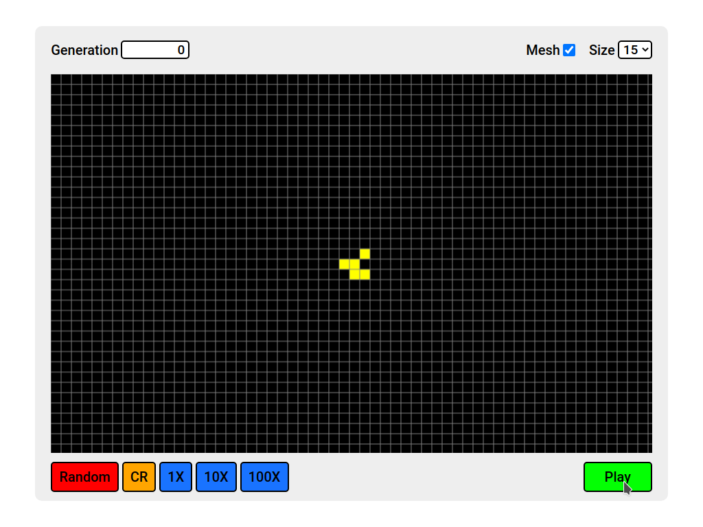
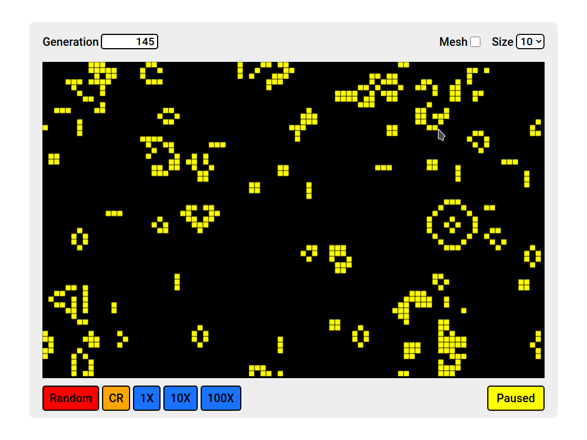
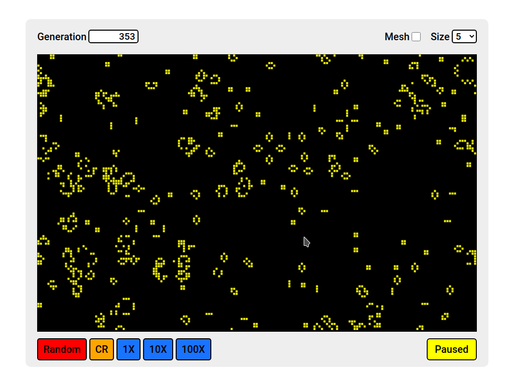
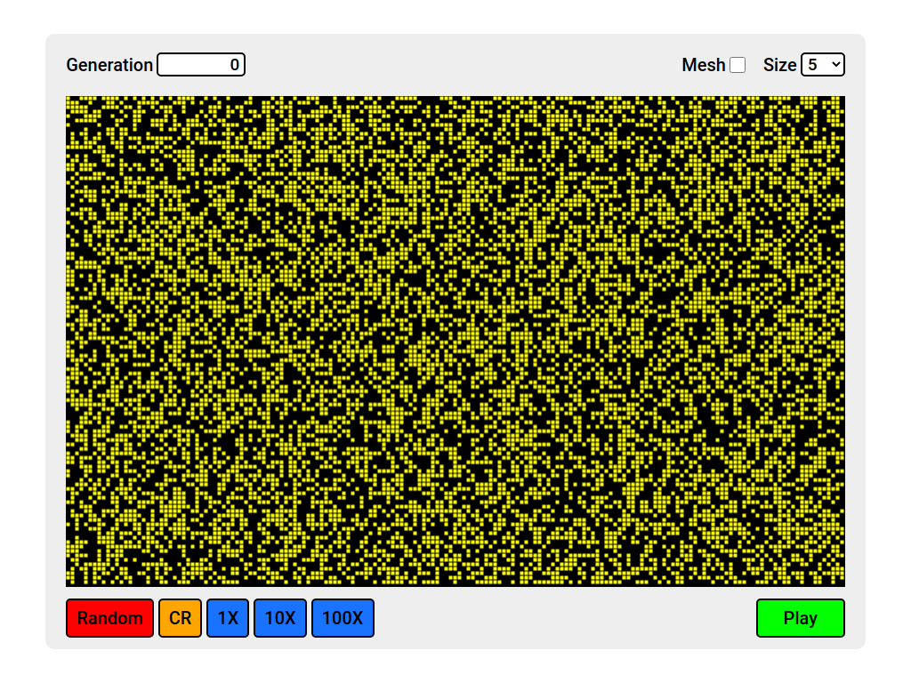

# GAME OF LIFE SIMULATOR

## Content
- [Purpose](#purpose)
- [Installation](#Installation)
- [Guide](#guide)
- [Support](#support)

## Purpose
**Purpose of this project is to create a app that can simulate the game of life simulation.**

In this app you can create new cell structures and simulate them. 
    
And you can change the cell size at the start.
    
And also you can generate random cell structures and simulate them.
    
To learn more what game of life is click [here](https://en.wikipedia.org/wiki/Conway's_Game_of_Life).

## Installation
* To use this app, first you should clone this to your local machine. To clone it copy and paste below command on your terminal. Then press enter to clone it.

    `git clone https://github.com/hashen47/GAME-OF-LIFE.git`

* After cloning is done go to the game of **GAME-OF-LIFE** folder.
* Then open the **index.html** file in your browser.

* Now you can see a interface like this.

    

* Now you can play with it :hugs: .

## Guide
* will be added in the future :innocent:
 
## Support
* Give a start for this project :yum: and follow :cowboy_hat_face: :partying_face: